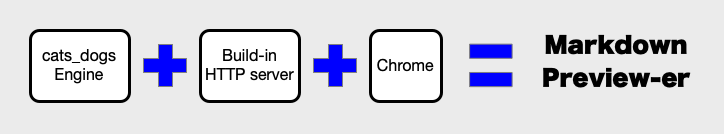
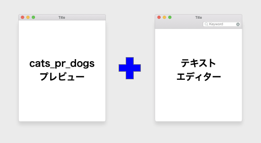
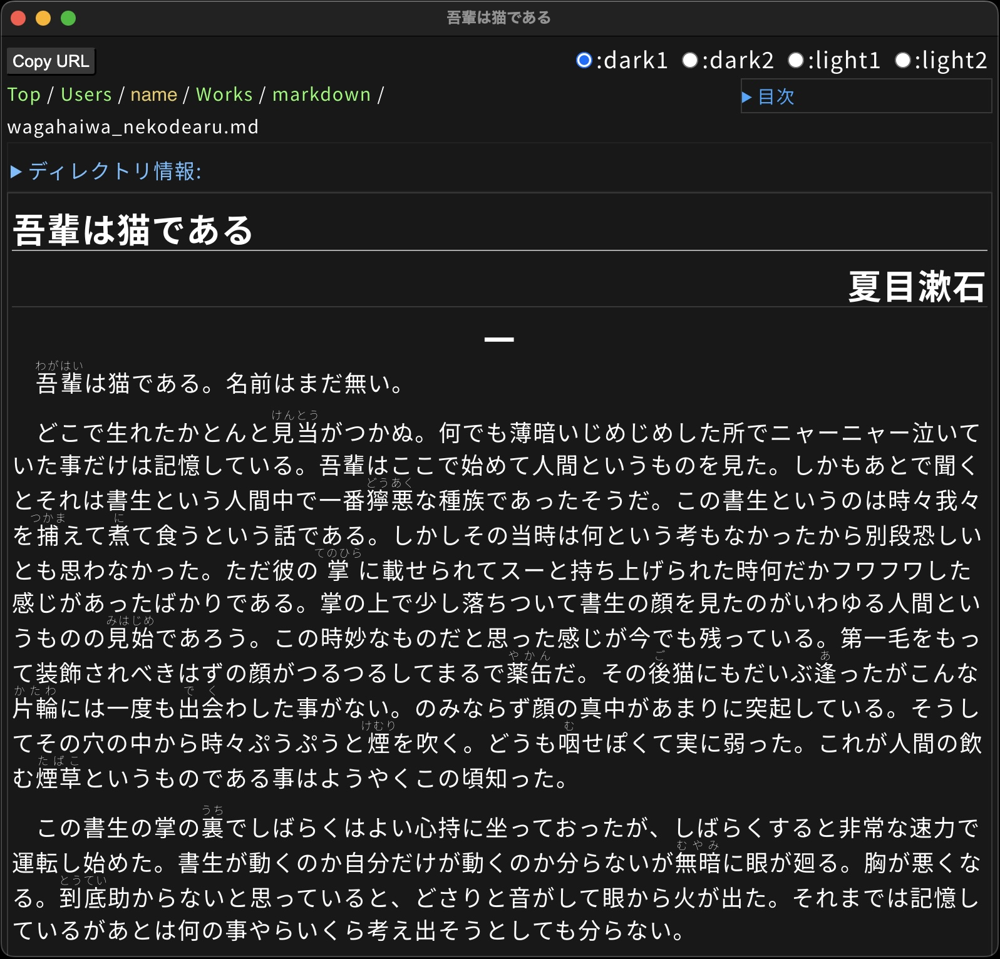
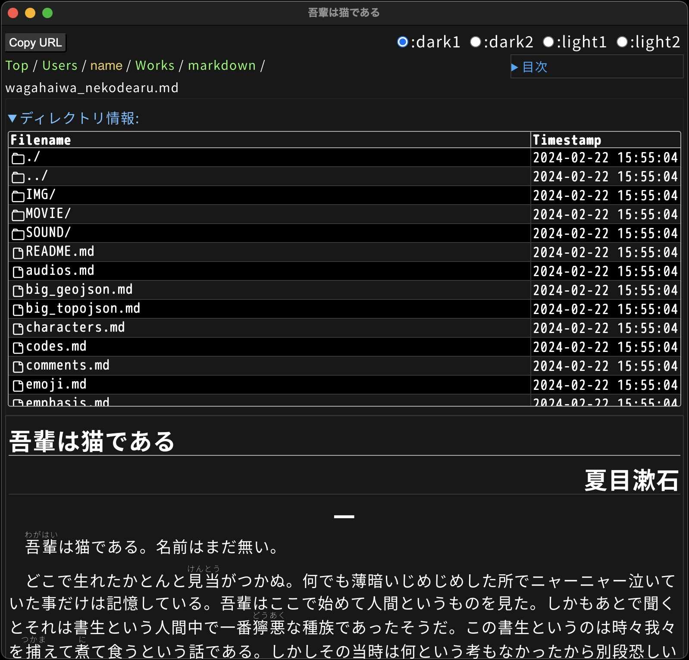
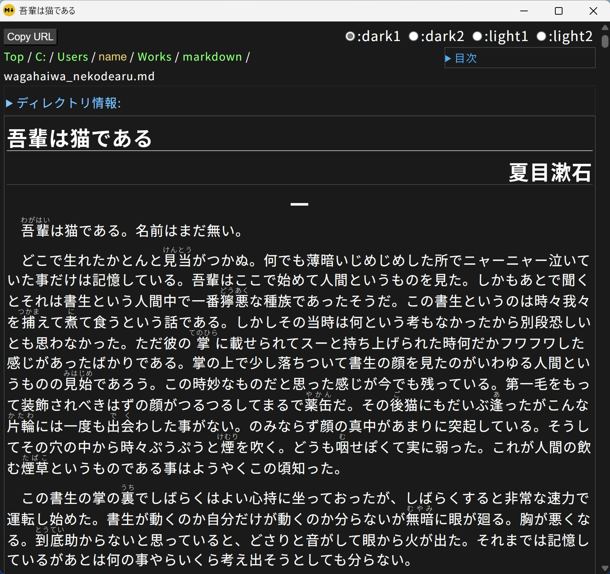
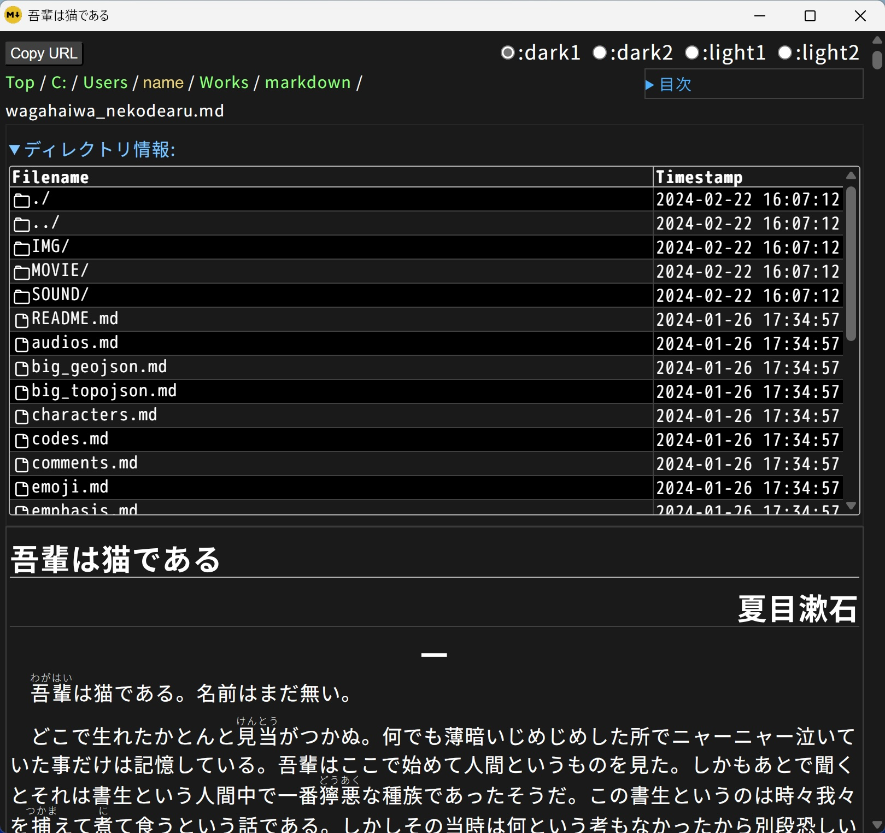
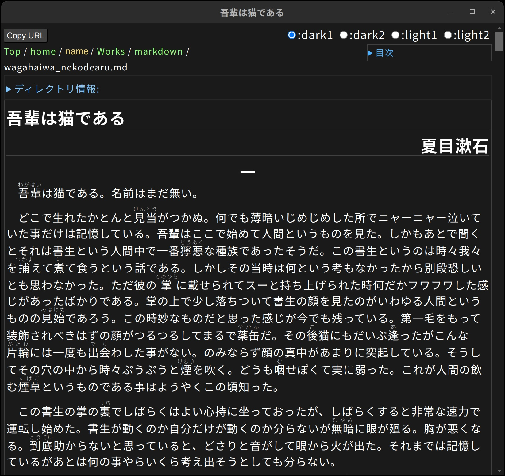
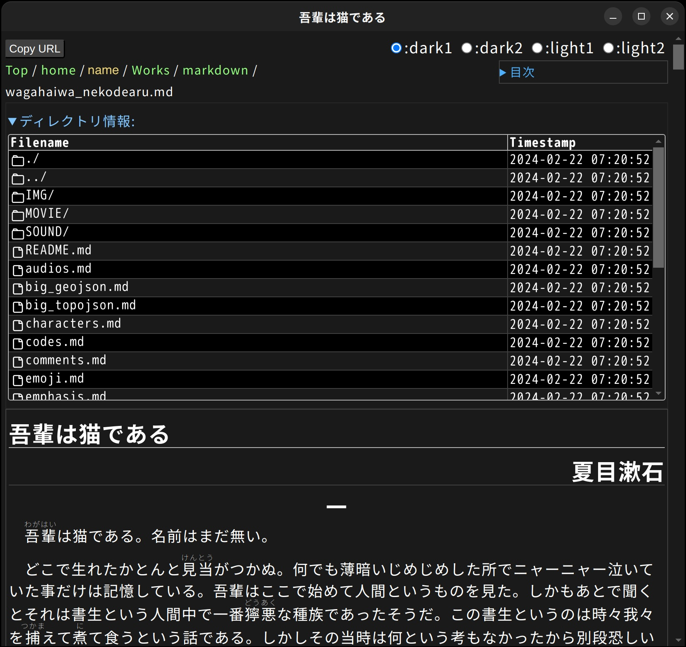
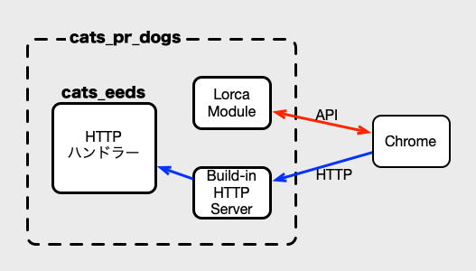

[cats\_dogs]: https://github.com/1f408/cats_dogs
[Chrome DevTools Protocol]: https://chromedevtools.github.io/devtools-protocol/
[Git for Windows]: https://gitforwindows.org/
[カスタマイズについて]: #カスタマイズについて
[go.devのDownload and install]: https://go.dev/doc/install
# cats\_pr\_dogs(CAT'S PReviewer for cats\_DOGS)

cats\_pr\_dogs(Cats Prairie Dogs)は、Markdownベースのドキュメントを<b>プレビュー</b>するアプリです。  
Markdownパーサには、cats\_dogs処理エンジンを使っています。

cats\_dogs処理エンジンとChrome互換ブラウザを連携させることで、デスクトップアプリでありながら、cats\_dogs互換の表示(GitHub like)を実現しています。



この構造により、cats\_pr\_dogsは、Markdownコンテンツを、

- 本物のブラウザ(Chrome互換ブラウザ)を使って、
- 手元のデスクトップ(Windows、MacOS、Ubuntu)で、
- Markdown処理エンジン(cats\_dogs)で、

事前確認(プレビュー)できるアプリになっています。

## 目的

cats\_pr\_dogsは、「メモ的に楽に確認したい」を目指して作りました。  
キレイに見せたいではなく、確認したいのでプレービューアプリなのです。

Markdownは、スペースや空行などのちょっとした違いで、表示を変えられます。
そのため、書きやすい反面、表示しないとミスに気がつきにくい書式でもあります。

そんなとき、  
「事前確認を楽にしたい。でも編集はいつものエディタを使いたい。」  
と考えたら、以下の絵のように、エディターの横にプレビューを並べられれば良いことに気がつきました。




cats\_pr\_dogsは、このような目的で作ったので、  
書くためのMarkdownエディタでもなく、キレイに見せるMarkdownビューアプリでもなく、きちんと表示するための<b>プレビュー</b>アプリ(プレビューア)なのです。

要は、cats\_dogsで書くのが楽になったので、事前確認でも楽するために、作りました。

## 特徴

cats\_pr\_dogsは、プレビューアプリとして、以下の手軽さを意識して作りました。

1. 準備の手軽さ
    - Webサーバへのアップロードの手間なしに、すぐにプレビューしたい。
        - Chrome互換ブラウザとcats\_pr\_dogsをインストールすれば、使えます。
1. 他人に見せずに確認できる手軽さ
    - 編集中は(サーバに置かずに)、こそっと確認したい。
        - サーバを用意しなくても、手元でプレビューできます。
1. 手元のデスクトップで動く手軽さ
    - いろいろなデスクトップOSで動きます。
        - Chrome互換ブラウザさえ入っていれば、MacOS、Windows、Ubuntu(Linux)で動きます。
        - 例えば、Arm版Windowsでも動きます。
    - Google Chrome、Chromium、Microsoft Edgeのどれかがあれば動きます。
1. エディタが制限されない手軽さ
    - プレビュー機能を理由に、使い慣れたエディタを捨てたくない。
        - プレビュー機能しかないので、お好きなエディタの横に並べて使えます。
        - viやメモ帳(notepad)でも、プレビューしながらMarkdownファイルを編集できます。
1. 編集と確認の切り替えの手軽さ
    - コンテンツを編集しながら、リアルタイムでプレビューしたい。
        - ファイル更新を検知して、自動reloadします。
        - (隣の)エディタでファイルを保存すると、勝手にreloadして表示を更新します。
1. 表示品質を心配しない手軽さ
    - 本物のブラウザを使うので、アプリ表示の正しさを疑う必要がありません。
    - Common MarkやGFM(GitHub Flavored Markdown Spec)にきちんと対応しています。
        - エディタの独自仕様なMarkdown記法に振り回されなくて済みます。
        - cats\_dogs同様に、Markdown仕様のカスタマイズが可能です。
1. cat\_tmplview用コンテンツ確認の手軽さ
    - cats\_dogsのcat\_tmplviewのアカウント別表示は、実際のアカウントの切り替えが必要で、事前確認が大変でした。
        - cat\_pr\_tmplなら、UI操作だけで、アカウント別表示を素早く切り替えられます。

## 画面イメージ

cats\_pr\_dogsは、異なるデスクトップOSのChrome互換ブラウザで動作します。

以下の画像ですが、異なるOSの異なるブラウザの組み合わせで、スクリーンショットを取ったものです。  
ブラウザ由来の表示の違いはありますが、cats\_dogsのWebコンテンツを表示してるときとあまり変わりません。

<details>
<summary>MacOS+Chrome</summary>



</details>

<details>
<summary>MacOS+Chrome(ディレクトリ開状態)</summary>



</details>

<details>
<summary>Windows+Edge</summary>



</details>

<details>
<summary>Windows+Edge(ディレクトリ開状態)</summary>



</details>

<details>
<summary>Ubuntu+Chromium</summary>



</details>

<details>
<summary>Ubuntu+Chromium(ディレクトリ開状態)</summary>



</details>

## cats\_pr\_dogsの構造

cats\_pr\_dogsは、以下の図のような構造で動作しています。



[Chrome DevTools Protocol]のAPIでブラウザを制御しているので、ChromeまたはChrome互換ブラウザが必須です。  
デフォルトでは、標準的なインストール先で、以下のChrome互換ブラウザを見つけて、利用します。

- Google Chrome
- Chromium
- Microsoft Edge

標準的でないインストール先にインストールしている場合や、利用するブラウザを選びたい時は、[カスタマイズについて]の説明を読んでください。

## cats\_pr\_dogsのアプリケーション群

cats\_pr\_dogsには、以下の2つのアプリが含まれています。

- [cat\_pr\_md](cat_pr_md.md)
    - [cats\_dogs]のcat\_mdviewと同じ仕様のMarkdownファイルのプレビューアプリです。
- [cat\_pr\_tmpl](cat_pr_tmpl.md)
    - [cats\_dogs]のcat\_tmplviewと同じ仕様のMarkdownなどのテンプレートファイルをプレビューアプリです。

用途に合わせて使い分けてください。

## ビルド手順

OSは、Windows、Ubuntu、MacOSでビルド可能です。  
CPUは、x86-64(AMD64)、ARM64(AArch64)でビルド可能です。

MacOSおよびUbuntuでは、以下の手順を、ターミナルで実行してください。  
Windowsでは、以下の手順を、<b>Git Bash</b>環境([Git for Windows]に付属)で実行してください。

1. Goをインストールする。
    - [go.devのDownload and install]などを参照して、Goをインストールします。
1. ソースをgitでダウンロードする。(作業用のディレクトリで、`git clone`を実行)
    ```
    git clone git@github.com:1f408/cats_pr_dogs.git
    ```
    もしくは、
    ```
    git clone https://github.com/1f408/cats_pr_dogs.git
    ```
1. `cats_pr_dogs`ディレクトリに移動する。
    ```
    cd cats_pr_dogs
    ```
1. 自分のOS用のビルドスクリプトを実行する。
    - Windowsでは、以下のBashスクリプトを実行してください。
        ```
        ./build-windows.bash
        ```
    - MacOSでは、下のスクリプトを実行してください。
        ```
        ./build-macapp.bash
        ```
    - Ubuntuでは、以下のスクリプトを実行してください。
        ```
        ./build-ubuntu.bash
        ```
    - これらのスクリプトは、Goを実行してcats\_pr\_dogsのアプリ群をビルドします。
    - ビルド中にGoの外部ライブラリをダウンロードするため、ネットワーク環境が必要です。
1. ビルドされたアプリを適切な場所にコピーする。
    - Windows用コマンドは`.\exe`ディレクトリに作成されます。
    - MacOS用アプリは`./app`ディレクトリに作成されます。
    - Ubuntu用のdebパッケージは`./deb`ディレクトリに作成されます。

## UIの説明

アプリを起動すると、ホームディレクトリを表示します。  
プレビューしたいファイルを、アプリ内のディレクトリ情報のファイルリストから選択して表示させて、使います。

### 自動的なリロード(再描画)

エディタなどでのファイル更新を検知して、自動的なリロード(再描画)する機能があります。
ただし、ファイル更新検知の機能はOSに依存するので、別ディレクトリにあるファイルの更新(埋め込み画像など)は、更新を検知しないことがあります。
更新が反映されない場合は、必要に応じて、手動でリロードしてください。(右クリックメニューの「再読み込み」などでリロードできます。)

### 「Copy URL」ボタン

アプリの左上の「Copy URL」ボタンをクリックすると、表示しているプレビュー用のURLがクリップボードにコピーされます。  
このプレビュー用のURLを使うと、Firefoxなどで表示が確認できます。

ただし、この表示方法では、アプリの制御がないので自動的なリロードは動きません。更新時は、手動でリロードしてください。  
また、このURLはcats\_pr\_dogsのアプリの終了とともにURLが無効になります。

### 「Account」入力欄

cat\_pr\_tmplには、アプリの左上に「Account」入力欄が追加されています。  
これは、ユーザによって表示内容が変化するコンテンツを確認するための機能です。
「Account」入力欄にユーザのアカウント名を入力すると、その権限で見ることが出来るコンテンツに変更されます。

アカウント設定のカスタマイズが必要になります。  
カスタマイズについては、[カスタマイズについて]で説明します。

## カスタマイズについて

正しくプレビューするには、利用しているサーバのcats\_dogsと設定を揃える必要があります。  
そのために、cats\_pr\_dogsは、cats\_dogsと同じエンジンを使って、同様のカスタマイズを可能にしています。  
ですので、cat\_pr\_mdはcat\_mdviewと、cat\_pr\_tmplはcat\_tmplviewと同様な設定が可能です。

ただ、設定ファイルの置き場所が、cats\_dogsとは大きく変わっていますので、カスタマイズが必要な場合は、以下の説明を参照してください。

- [カスタマイズ方法](customize.md)

## 内部仕様

- [ファイル構成](file_tree.md)
