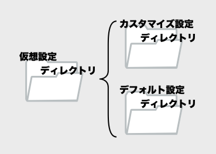
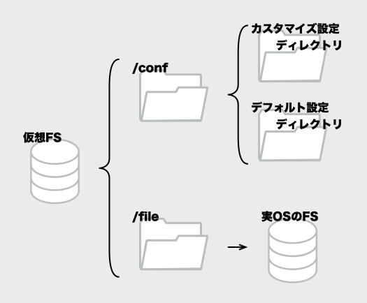

[本格的なカスタマイズの概略]: #%E6%9C%AC%E6%A0%BC%E7%9A%84%E3%81%AA%E3%82%AB%E3%82%B9%E3%82%BF%E3%83%9E%E3%82%A4%E3%82%BA%E3%81%AE%E6%A6%82%E7%95%A5
[カスタマイズ設定ディレクトリ]: #%E3%82%AB%E3%82%B9%E3%82%BF%E3%83%9E%E3%82%A4%E3%82%BA%E8%A8%AD%E5%AE%9A%E3%83%87%E3%82%A3%E3%83%AC%E3%82%AF%E3%83%88%E3%83%AA%E3%81%AE%E5%A0%B4%E6%89%80
[cat\_mdviewの設定]: https://github.com/1f408/cats_dogs/blob/master/docs/cat\_mdview.md
[cat\_tmplviewの設定]: https://github.com/1f408/cats_dogs/blob/master/docs/cat\_tmplview.md
[cats\_dogsのMarkdown設定]: https://github.com/1f408/cats_dogs/blob/master/docs/markdown_format.md
[cats\_dogsのuser_map設定]: https://github.com/1f408/cats_dogs/blob/master/docs/user_map.md#user_map%E3%81%AE%E8%A9%B3%E7%B4%B0
[cats\_dogs]: https://github.com/1f408/cats_dogs
# カスタマイズ方法

cats\_pr\_dogsの設定ファイルは、ファイルパスの違いを除けば、基本的に、cats\_dogsと同じ書式です。  
ですので、この説明では、おもに、カスタマイズにファイルをどこに置くかについて説明します。

すべてを理解する必要もないので、以下の4つにわけて説明します。

- 簡易なカスタマイズの手順
- 設定ファイルのディレクトリ
- 本格的なカスタマイズの概略
- cats\_pr\_dogs独自設定ファイル

目的に応じて、必要な部分を読んでください。

----
# 簡易なカスタマイズの手順

簡易なカスタマイズ方法としての「設定ファイルを1つだけ書き換える」手順を説明します。  
それ以外のカスタマイズについては、[本格的なカスタマイズの概略]を参照してください。

以下が、「設定ファイルを1つ置き換える手順」です。

1. レポジトリの[conf/etc以下](../conf/etc/)から、変更したいファイルを選ぶ。
1. カスタマイズ設定ディレクトリに、`etc`ディレクトリを作成する。
1. 変更したいファイルを、同じファイル名で、カスタマイズ設定ディレクトリの`etc`ディレクトリにコピーする。
1. コピーしたファイルを編集する。
1. アプリを再起動する。

「カスタマイズ設定ディレクトリ」の場所については、[カスタマイズ設定ディレクトリ]の説明を参照してください。  
設定ファイルのパスは、仮想ファイルシステムのパスで指定する必要があるので、注意してください。

## カスタマイズしやすそうな設定ファイル

参考として、始めにカスタマイズしそうなファイルをリストアップしておきます。

| デフォルト設定ファイル | 設定ファイルの概略 | cats\_dogsの説明ページ |
| :-- | :-- | :-- |
| [etc/mdview.conf](../conf/etc/mdview.conf) | cat\_pr\_mdの設定 | [cat\_mdviewの設定]と同じ |
| [etc/tmplview.conf](../conf/etc/tmplview.conf) | cat\_pr\_tmplの設定 | [cat\_tmplviewの設定]と同じ |
| [etc/markdown.conf](../conf/etc/markdown.conf) | Markdown仕様の設定 | [cats\_dogsのMarkdown設定]と同じ |
| [etc/usermap.conf](../conf/etc/usermap.conf) | アカウントリスト(cat\_pr\_tmpl利用) | [cats\_dogsのuser_map設定]と同じ |

設定ファイルについても、基本的にcats\_dogsと同じ仕様なので、詳細については、[cats\_dogs]のドキュメントを参照してください。  
ただし、以下の設定ファイルのパラメータは、設定ファイルの記述を無視しますので、注意してください。

| 設定ファイル名 | 無効なパラメータ名 |
| :-- | :-- |
| [etc/mdview.conf](../conf/etc/mdview.conf) | `url_top_path`、`document_root`、`directory_view_roots` |
| [etc/tmplview.conf](../conf/etc/tmplview.conf) | `url_top_path`、`tmpl.document_root`、`tmpl.directory_view_roots` |

----

# 設定ファイルのディレクトリ

以下の絵のように、デフォルト設定ディレクトリとカスタマイズ設定ディレクトリが組み合わされて、cats\_pr\_dogs内で 仮想的なディレクトリの`/conf`として扱われています。

この仮想的なディレクトリの`/conf`は、カスタマイズ設定ディレクトリを優先するので、カスタマイズ設定ディレクトリで、デフォルト設定を上書きできます。

この設定ファイル用仮想的なディレクトリの`/conf`を、以後「仮想設定ディレクトリ」と呼びます。

## デフォルト設定ディレクトリの場所

レポジトリの[conf](../conf)の、以下のサブディレクトリが、ビルド時にアプリへ仮想設定ディレクトリ(仮想ディレクトリの`/conf`)の一部として組み込まれます。

| 仮想設定ディレクトリのサブディレクトリ | 概要 |
| :-- | :-- |
| `etc` | アプリの設定ファイル群 |
| `lib` | templateやICONなどのHTML生成に使用するファイル |
| `www` | Build-in HTTPサーバのルートディレクトリ |

## カスタマイズ設定ディレクトリの場所

カスタマイズする場合のファイルの置き場は、アプリとOSで異なるので、以下のOSごとの表を参照してください。

**Windowsの場合**

| アプリ名 | カスタマイズ設定ディレクトリ |
| :-- | :-- |
| cat\_pr\_md(CatPrMd) |`%AppData%\CatPrMd` |
| cat\_pr\_tmpl(CatPrTmpl) | `%AppData%\CatPrTmpl` |

**MacOSの場合**

| アプリ名 | カスタマイズ設定ディレクトリ |
| :-- | :-- |
| cat\_pr\_md(CatPrMd) | `~/Library/Application Suppot/CatPrMd` |
| cat\_pr\_tmpl(CatPrTmpl) | `~/Library/Application Suppot/CatPrTmpl` |

**Ubuntuの場合**

| アプリ名 | カスタマイズ設定ディレクトリ |
| :-- | :-- |
| cat\_pr\_md(CatPrMd) | `${XDG_CONFIG_HOME}/.config/CatPrMd` もしくは`${HOME}/.config/CatPrMd` |
| cat\_pr\_tmpl(CatPrTmpl) | `${XDG_CONFIG_HOME}/.config/CatPrTmpl` もしくは`${HOME}/.config/CatPrTmpl` |

cats\_pr\_dogsの各アプリは、カスタマイズ設定ファイル置き場とデフォルト設定ファイル置き場の両方から設定ファイルを探します。

以下の例を見ると分かりやすい思いますが、設定ファイルを置くときには、デフォルト設定ディレクトリとサブディレクトリのパスを同じものにする必要がありますので、注意してください。

### `etc/markdown.conf`の置き場所の例

`etc/markdown.conf`をカスタマイズするときのファイルの場所の例です。

Windowsでユーザディレクトリが`hoge`の場合、デフォルトインストールでは、以下がコピー先になります。
(`hoge`の部分をご自分の環境に合わせて適宜読み替えてください。)

| アプリ名 | 置き場 |
| :-- | :-- |
| cat\_pr\_md(CatPrMd) | `C:\Users\hoge\AppData\Roaming\CatPrMd\etc\markdown.conf` |
| cat\_pr\_tmpl(CatPrTmpl) | `C:\Users\hoge\AppData\Roaming\CatPrTmpl\etc\markdown.conf` |

MacOSの場合は、デフォルトではホームディレクトリの以下の場所になります。

| アプリ名 | 置き場 |
| :-- | :-- |
| cat\_pr\_md(CatPrMd) | `~/Library/Application Suppot/CatPrMd/etc/markdown.conf` |
| cat\_pr\_tmpl(CatPrTmpl) | `~/Library/Application Suppot/CatPrTmpl/etc/markdown.conf` |

Ubuntuのデフォルトでは、ホームディレクトリの以下の場所になります。

| アプリ名 | 置き場 |
| :-- | :-- |
| cat\_pr\_md(CatPrMd) | `~/.config/CatPrMd/etc/markdown.conf` |
| cat\_pr\_tmpl(CatPrTmpl) | `~/.config/CatPrTmpl/etc/markdown.conf` |

----

# 本格的なカスタマイズの概略

cats\_pr\_dogsは、カスタマイズ設定ディレクトリにファイルを置くことで、デフォルトのファイルを置き換えることができます。  
cats\_dogsと同様に、かなり柔軟なカスタマイズができるようになっています。

そして、置き換えられるファイルは、設定ファイルだけではありません。
CSSファイル、テンプレートファイル、JavaScriptファイルなどの、HTML生成に使われるファイルも置き換え可能です。
cats\_dogsと同じように、HTML的な見た目も変更することも可能です。

このようなカスタマイズの柔軟性は、cats\_pr\_dogs内の仮想的なファイルシステムで成り立っています。  
柔軟にカスタマイズするなら、この仮想ファイルシステムの理解が必要になります。
理解なしには、ファイル内のパスを正しく書き換えられないからです。

## 仮想ファイルシステムとは

以下の絵のような構造の仮想ファイルシステム経由で、各種の設定ファイルは読み込まれます。

この仮想ファイルシステムでは、以下のルールで、仮想設定ディレクトリとOSのファイルシステムをマップしています。

- `/conf`に仮想設定ディレクトリをマップする。
- `/file`にOSのファイルシステムをマップする。

## 仮想ファイルシステムのパス変換

OSのファイルシステムからのパス変換ついては、OSによって異なりますので、個別に説明します。

### Windowsの場合

1. 絶対パスに変換する。
1. パスの区切りの`\`を`/`に変換する。
1. ドライブレター(`C:`や`D:`など)の前に`/file/`を追加する。

以下は、変換の例です。

| WindowsのOSパス | cats\_pr\_dogsの設定ファイルのパス |
| :-- | :-- |
| `C:\Program Files (x86)\Microsoft\Edge\Application\msedge.exe` | `/file/C:/Program Files (x86)/Microsoft/Edge/Application/msedge.exe` |
| `C:\Users\user\Works\cats_pr_dogs` | `/file/C:/Users/user/Works/cats_pr_dogs` |

Windowsの場合、OSのファイルは、`/file/`をつけたUnixライクなファイルパスになるわけです。

### LinuxおよびMacOSの場合

1. 絶対パスに変換する。
1. 先頭に`/file`を追加する。

以下は、変換の例です。

| MacOSのパス | cats\_pr\_dogsの設定ファイルのパス |
| :-- | :-- |
| `/Applications/Google Chrome.app/Contents/MacOS/Google Chrome` | `/file/Applications/Google Chrome.app/Contents/MacOS/Google Chrome` |
| `/Users/user/Works/cats_pr_dogs` | `/file/Users/user/Works/cats_pr_dogs` |

LinuxおよびMacOSでは、OSのファイルは、`/file/`がついたパスになるわけです。

## Build-in HTTPサーバのURLパス変換

Webコンテンツとしてchromeに渡しているファイルを大幅にカスタマイズするには、cats\_pr\_dogsが、URLをどのように変換するかを知っておく必要があります。

そのURL変換を行っているBuild-in HTTPサーバは、URLのパスを仮想ファイルシステムのパスへ、以下のようにマッピングして処理しています。

| URLのパス | 仮想ファイルシステムのパス | 処理概要 |
| :-- | :-- | :-- |
| `/file` | `/file/` | cats\_dogs処理エンジンで変換して提供します。 |
| `/` | `/conf/www` | ファイルを変換せずに提供します。|

仮想ファイルシステムでもパスを変換しているので、URLは多段の処理で、OSのパスへ変換されることになります。

----
# cats\_pr\_dogs独自設定ファイル

cats\_pr\_dogs独自の機能があるので、一部、cats\_dogsと異なる仕様の設定ファイルがあります。  
そのようなcats\_dogsと差異がある設定ファイルの仕様について、個別に説明します。

## ファイルパスが固定された設定ファイル

cats\_dogsでは、コマンド毎の設定ファイルは、コマンド引数で渡していました。

デスクトップアプリにしたことで、ファイル名を渡すのが難しいケースがあり、コマンド引数で渡されるファイルパスについては、以下のように固定的なパスになっています。

| 対象のアプリ | 仮想ディレクトリ上のパス | 概要 |
| :-- | :-- | :-- |
| cat\_pr\_md | `/conf/etc/mdview.conf` | cat\_mdviewの設定ファイル相当 |
| cat\_pr\_tmpl | `/conf/etc/tmplview.conf` | cat\_tmplviewの設定ファイル相当 |

これらのファイルについては、ファイルパスの違い以外は、cats\_dogsの設定ファイルと同じ仕様です。

## OSのファイルパスが書かれる設定ファイル

以下のファイルは、cats\_pr\_dogsが起動する上で必要な、OSの情報が書かれています。
(chromeコマンドのOSのファイルパスがなどが書かれています。)

| 仮想ファイルシステムのパス | 概要 |
| :-- | :-- |
| `/conf/etc/pr_dogs.conf` | 主にOS依存の情報が書かれています。 |

このファイルだけは、実際のOS上のファイルパスが書かれていますので、注意が必要です。

## 自動生成されるファイル

以下は、アプリが自動生成するファイルなので、利用者は編集しないでください。

| 対象のアプリ| ファイルパス| 概要 |
|:-- | :-- | :-- |
| cat\_pr\_md、cat\_pr\_tmplの両方 | カスタマイズ設定ディレクトリの`window.conf` | ウィンドウ情報を保存します。起動時に読み込み、終了時に書き込まれます。|

